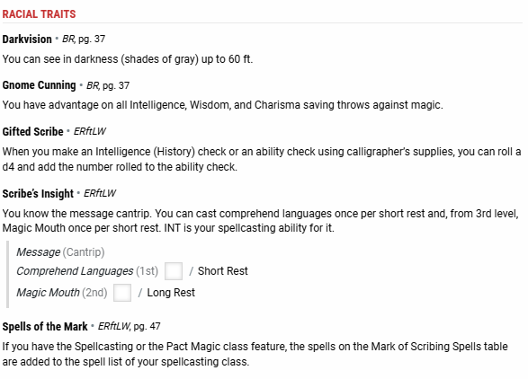

# Gnomenclature

Race: Gnome
Class: Cleric
Number: 3
Path: Mark of Scribing
Trained Skills: Arcana, History, Medicine, Nature, Religion
Prof Bonus: 2
P. Pcpt: 13
P. Inv: 13
P. Ins: 15
Link: https://www.dndbeyond.com/characters/115342846
Player: Jared
Languages: Common, Deep Speech, Gnomish, Goblin, Ogre, Orc
Background: Cloistered Scholar
Alignment: Neutral-Good
Size: Small
Short Term Goal: How the fuck did I get get here and why do I have this tattoo on my neck?
Mid Term Goal: Find others in this clan and figure out why we were all brought in
Long Term Goal:  Find the knowledge necessary to help the clan bring about the end of the war
Racial Traits: Darkvision, Gifted Scribe, Gnome Cunning, Scribes Insight, Spells of the Mark
Main Quests: (1)Lost Miners & Diplomatic Relations (../../Quests/Quests%20Home/(1)Lost%20Miners%20&%20Diplomatic%20Relations%20bc501c7e027048e1973d2b2b85ca7b25.md), Gnomenclature’s Side Quest (../../Quests/Quests%20Home/Gnomenclature%E2%80%99s%20Side%20Quest%2034b6d78259b447829fe4550e6f7c5205.md)

https://www.dndbeyond.com/characters/115342846

[Session 0 Notes](Gnomenclature/Session%200%20Notes%20fcbec5079b374a6a852140fb22f858f4.md)

## Character Information

## Gnomenclature

**Race:** Mark of Scribing Gnome

**Class & Level:** Cleric 3

**Player Name:** Jared

**Background:** Cloistered Scholar

**Experience Points:** (Milestone)

## Attributes

**Strength:** 10

**Dexterity:** 14

**Constitution:** 12

**Intelligence:** 16

**Wisdom:** 18

**Charisma:** 12

## Skills

**Acrobatics (DEX):** +2

**Animal Handling (WIS):** +4

**Arcana (INT):** +5

**Athletics (STR):** +0

**Deception (CHA):** +1

**History (INT):** +5

**Insight (WIS):** +6

**Intimidation (CHA):** +1

**Investigation (INT):** +5

**Medicine (WIS):** +6

**Nature (INT):** +3

**Perception (WIS):** +4

**Performance (CHA):** +1

**Persuasion (CHA):** +3

**Religion (INT):** +5

**Sleight of Hand (DEX):** +2

**Stealth (DEX):** +2

**Survival (WIS):** +4

## Saving Throws

**Toggle List**: Saving Throws

- **Strength**: +1
- **Dexterity**: +2
- **Constitution**: +4
- **Intelligence**: +5
- **Wisdom**: +1
- **Charisma**: +0

## Combat Stats

**Initiative:** +2

**Armor Class:** 16

**Speed:** 25 ft.

**Hit Points:** Max HP: 24, Current HP: 24, Temp HP: 0

**Proficiency Bonus:** +2

**Ability Save DC:** 14

## Spellcasting

**Spellcasting Class:** Cleric

**Spellcasting Ability:** Wisdom

**Spell Save DC:** 14

**Spell Attack Bonus:** +6

**Spells:**

- **Cantrips (At Will):** Light, Sacred Flame, Thaumaturgy
- **1st Level (4 Slots):** Bless, Cure Wounds, Healing Word, Shield of Faith
- **2nd Level (3 Slots):** Hold Person, Spiritual Weapon

## Proficiencies & Languages

**Armor:** Light Armor, Medium Armor, Shields

**Weapons:** Simple Weapons

**Tools:** None specified

**Languages:** Common, Gnomish, Draconic, Elvish

### **Hit Dice:** Total 3d8

**Death Saves:** Successes: [0], Failures: [0]

## Appearance and Backstory

**Alignment:** Neutral Good

**Gender:** Male

**Size:** Small

**Age:** 120

**Height:** 3'4"

**Weight:** 40 lb.

**Eyes:** Blue

**Hair:** White

**Skin:** Fair

**Faith:** Oghma

**Character Appearance:** A small gnome with a twinkle in his eye, wearing simple yet functional cleric robes, always carrying a book and a holy symbol.

**Allies & Organizations:** Member of the Order of the Scroll

**Character Backstory:** Gnomenclature has spent most of his life in the great library of his order, studying ancient texts and preserving knowledge. His dedication to learning and the pursuit of wisdom has earned him a place among the scholars, and he now ventures into the world to gather new knowledge and protect the sacred tomes of his order.

**Additional Notes:** Every great adventure begins with a single step.

**Ideals:** Knowledge is the path to power and enlightenment.

**Bonds:** Protect the library and its knowledge at all costs.

**Flaws:** Often lost in thought and distracted by scholarly pursuits.

**Personality Traits:** Curious and inquisitive, always eager to learn new things and share knowledge with others.

## Equipment

**Currency:** CP: 10, SP: 5, EP: 2, GP: 15, PP: 0

**Weight Carried:** 50 lb.

**Encumbered:** 120 lb.

**Push/Drag/Lift:** 240 lb.

**Items:**

- **Mace:** 1, 4 lb.
- **Shield:** 1, 6 lb.
- **Explorer's Pack:** 1, 10 lb.
- **Holy Symbol:** 1, 1 lb.

## Additional Features & Traits

- **Darkvision:** Can see in dim light within 60 feet as if it were bright light.
- **Gnome Cunning:** Advantage on all Intelligence, Wisdom, and Charisma saving throws against magic.
- **Divine Domain:** Knowledge
- **Blessing of Knowledge:** At 1st level, gain proficiency in two of the following skills: Arcana, History, Nature, or Religion. Your proficiency bonus is doubled for any ability check you make that uses either of those skills.
- **Channel Divinity:** Turn Undead, Knowledge of the Ages

